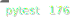

# ConnectionZ

_ConnectionZ - это Python библиотека для графового анализа, нацеленная на продуктовое применение. Содержит множество инструментов, готовых для применения "из коробки", а также подробные инструкции с описанием принципов работы каждого алгоритма и модуля._





## Установка

ConnectionZ пока что не доступен в PyPi. Для использования библиотеки, нужно склонировать репозиторий:

```
git clone git@github.com:ekertn7/ConnectionZ.git
```

И указать путь до него в sys path:

```python
import sys
sys.path.insert(1, '~/Downloads/ConnectionZ')
import connectionz as cnnnz
# your code
```

_В ближайшее время мы обязательно разместим библиотеку в PyPi :)_

## Пример использования

```python
>>> import connectionz as cnnnz
>>> graph = cnnnz.DirectedGraph()
>>> graph.add_edge('Alex', 'Victoria', '2024-05-17', amount=1800)
>>> graph.add_edge('Robert', 'Victoria', '2024-09-23', amount=2100)
>>> graph.add_edge('Robert', 'Victoria', '2024-11-26', amount=1200)
>>> graph
'Multi Directed Graph with 3 nodes, 2 couples and 3 edges'
```

## Инструкция

-   [Основы работы](/documentation/graph.md)
-   [Импорт и экспорт графа](/documentation/import_export.md)
-   [Теория графов](/documentation/theoretics.md)

## Лицензия

Выпущено по [лицензии BSD (с тремя пунктами)](/LICENSE).

## Разработчики

@ekertn7: Nikita Ekert [ekertn7@gmail.com](mailto:ekertn7@gmail.com)
